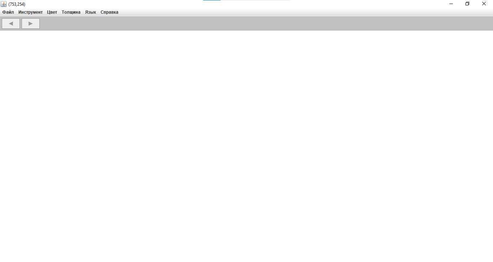
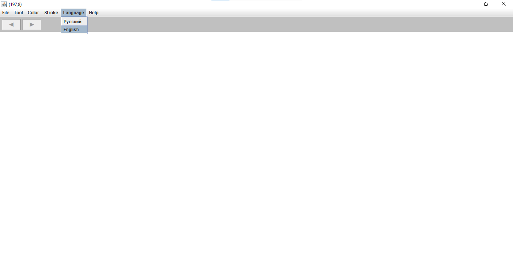
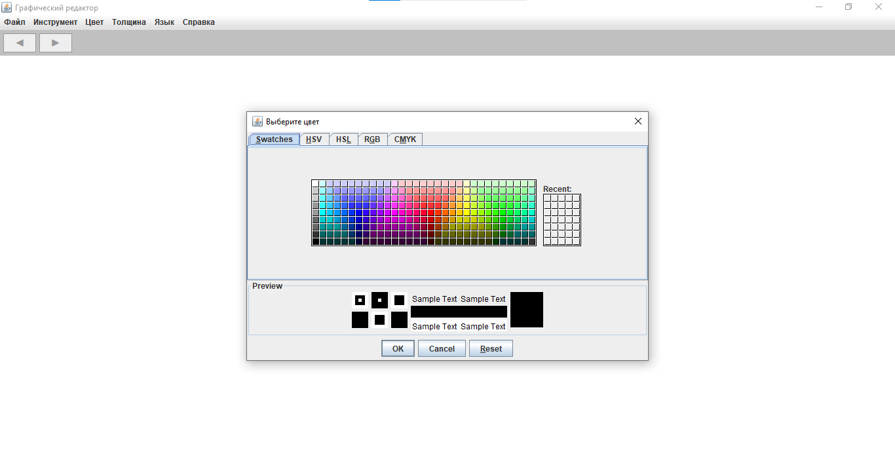
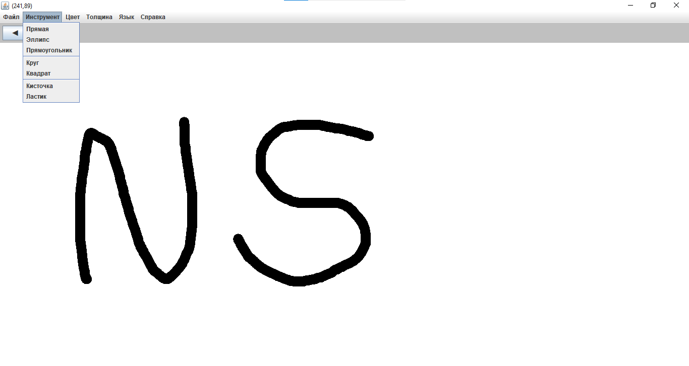
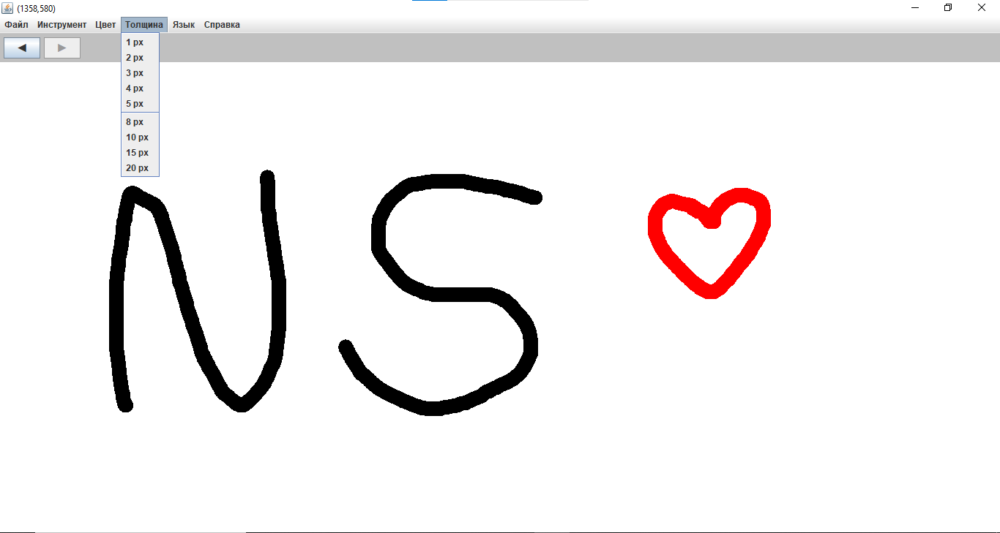
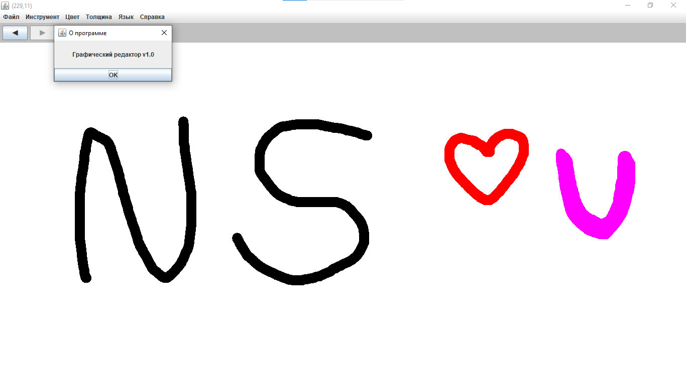

# Painter

> Basic calculator – first steps in Python, Phase I.

## 💻 Project Run
- Open with Java: [Painter.java](Painter.java)
  
- Or download exe: [Painter.jar](https://github.com/NebulaStack-prog/Calculator-v.1/releases/tag/v1.0)

## 📄 Full Documentation
- 🇷🇺  Russian version: [Documentation](Calculator_v.1_RU.md)
  
- 🇺🇲  English version: [Documentation](Calculator_v.1_EN.md)
  
## 📷 Screenshots

© NebulaStack
